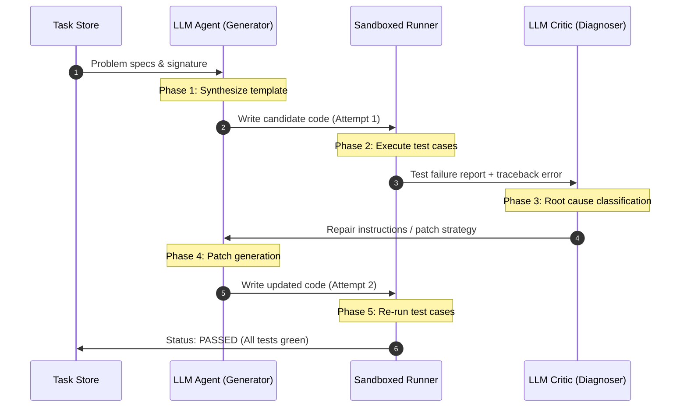

# Learning Guide: Self-Evolving Agentic Code Repair

Welcome to the **Evo-Adapt** codebase learning guide! This guide was built to help you understand the core mechanics of self-evolving/self-repairing LLM agent systems and how this specific project models that loop.

Whether you are vibe coding using Antigravity or writing the backend adapters yourself, this guide will serve as a map of the current codebase, the concepts behind execution-guided repair, and how to extend the simulation to do live runs.

---

## 1. Introduction: What is a Self-Evolving Code Agent?

A traditional LLM-based code generator is a **one-shot pipeline**:
1. You provide a prompt.
2. The LLM generates the code.
3. If it contains a bug, the program crashes, and you (the human) have to re-prompt it.

A **self-evolving code agent** introduces an autonomous feedback loop called **Execution-Guided Code Repair (Self-Repair)**:
```
       ┌────────────────────────┐
       │     Task Provider      │
       └───────────┬────────────┘
                   │ Description & Signature
                   ▼
       ┌────────────────────────┐
       │     Code Generator     │◄──────────────────┐
       └───────────┬────────────┘                   │
                   │ Candidate Code                 │
                   ▼                                │
       ┌────────────────────────┐                   │
       │   Sandbox Executer     │                   │
       └───────────┬────────────┘                   │
                   │ Logs, Assertions, Traceback    │
                   ▼                                │
      / ─────────── ─────────── \                   │
    <   Are all test cases PASS?  >                 │ Repair Patch
      \ ───────────┬─────────── /                   │
                   │                                │
          YES ┌────┴────┐ NO                        │
              │         ▼                           │
              │   ┌─────────────┐                   │
              │   │  Diagnoser  ├─► Repair Strategy─┘
              │   │   (Critic)  │
              ▼   └─────────────┘
         Success!
```

By putting the LLM inside a loop with a test runner, the agent behaves like a human developer: it writes code, runs the tests, reads the error message, determines why it failed, edits the code, and tests it again until it succeeds or runs out of attempts.

---

## 2. Architectural Blueprint

Here is the flow of information across a single attempt loop:



---

## 3. Codebase Mapping: How Evo-Adapt Models this System

Here is a map of the files in this workspace and how they fit into the architecture:

### The Data Layer & Types
- [types.ts](file:///c:/Users/Thinkpad/Desktop/top-tier-projects/evo-adapt/src/lib/types.ts): Defines the structures of the system.
  - `Task`: A programming problem containing a title, description, function signature, and a set of `TestCase` items (inputs and expected outputs).
  - `Attempt`: Stores the code candidate, test run execution statuses, agent classification diagnostic feedback, and events generated during that specific iteration.
  - `TraceEvent`: High-resolution log entries showing the timeline of actions (e.g. `Initiating code generation`, `Failure classified`, `Patch generated`).
  - `Metrics`: Aggregated run stats such as latency, token usage, cost, and progress.

### The Simulated Runner
- [mock-agent.ts](file:///c:/Users/Thinkpad/Desktop/top-tier-projects/evo-adapt/src/lib/mock-agent.ts): Stores the detailed simulation trace step sequence. This contains every transition in state, code, and logs, mirroring how a live LLM sequence unfolds.
- [mock-data.ts](file:///c:/Users/Thinkpad/Desktop/top-tier-projects/evo-adapt/src/lib/mock-data.ts): Contains default programming problems (Two Sum, Valid Parentheses, Reverse Linked List) along with pre-baked attempts and mock benchmarks.

### The Application Logic & UI
- [use-agent-run.ts](file:///c:/Users/Thinkpad/Desktop/top-tier-projects/evo-adapt/src/hooks/use-agent-run.ts): Custom React hook handling the active attempt navigation. It computes active metrics and trace events across the different attempts.
- [page.tsx](file:///c:/Users/Thinkpad/Desktop/top-tier-projects/evo-adapt/src/app/page.tsx): Main layout grid connecting the Task Panel, Code Workspace, and Agent Activity timelines.
- [code-workspace.tsx](file:///c:/Users/Thinkpad/Desktop/top-tier-projects/evo-adapt/src/components/workspace/code-workspace.tsx): A Monaco code editor that loads the code for the selected attempt in read-only/modifiable mode with color themes (`recode-warm-light` and `recode-warm-dark`). Displays the tests outcomes, execution logs, and tracebacks underneath.
- [agent-activity.tsx](file:///c:/Users/Thinkpad/Desktop/top-tier-projects/evo-adapt/src/components/activity/agent-activity.tsx) & [attempt-group.tsx](file:///c:/Users/Thinkpad/Desktop/top-tier-projects/evo-adapt/src/components/activity/attempt-group.tsx): Renders a beautiful visual timeline grouping events per attempt.

---

## 4. Step-by-Step Simulation Walkthrough (The Two Sum Example)

Let's dissect what happens when the agent runs the **Two Sum** task simulation:

### Attempt 1: The Initial Bug
The agent generates the following candidate code:
```python
def two_sum(nums: List[int], target: int) -> List[int]:
    # Inefficient lookup that fails on duplicate values
    for i in range(len(nums)):
        complement = target - nums[i]
        if complement in nums:
            return [i, nums.index(complement)]
    return []
```

- **Execution Results**: 3 out of 5 tests pass, but `test_case_03` (`nums = [3, 3]`, `target = 6`) fails with `AssertionError: Expected [0,1] but got [0,0]`.
- **Why?** Since `nums.index(complement)` always returns the *first* occurrence of a value, looking up the complement of the first `3` returns index `0` instead of index `1`. The code registers this as self-lookup.

### The Diagnostics (Critic Phase)
The test runner feeds this error output back:
```
AssertionError: Expected [0, 1] for nums=[3, 3], target=6, but received [0, 0] because of self-lookup.
```
The critic classifies this failure:
- **Diagnostic Label**: `Failure classified` / `Boundary condition issue: complement lookup selects current element.`
- **Repair Strategy**: Update the lookup mechanism to avoid picking the current element. Suggest caching elements in a dictionary as we iterate.

### Attempt 2: The Successful Patch
Based on the repair strategy, the agent updates the code to:
```python
def two_sum(nums: List[int], target: int) -> List[int]:
    seen = {}
    for i, num in enumerate(nums):
        complement = target - num
        if complement in seen:
            return [seen[complement], i]
        seen[num] = i
    return []
```
- **Execution Results**: The runner runs the test suite again. All 5 test cases pass successfully.
- **Outcome**: The agent transitions to the `passed` state, saving cost and tokens from further attempts.

---

## 5. Transitioning from Mock Simulation to Live Code Agent

If you want to turn this frontend application from a simulation into a real, live autonomous developer assistant running on your machine, you need to implement three backend components:

### A. The Secure Sandbox Execution Environment
Never run AI-generated code directly on your host machine! It could contain loops, delete files, or make malicious network requests.
- **Solution 1 (Docker)**: Spin up a lightweight Python Docker container:
  ```bash
  docker run --rm -v $(pwd)/temp:/app python:3.11-slim python /app/solution_test.py
  ```
- **Solution 2 (Wasm)**: Use Pyodide (Python compiled to WebAssembly) to run tests directly in the browser sandboxed.

### B. Prompt Templates for Agent Stages
Here are the prompts you would send to the LLM at each phase:

#### 1. Initial Generation Prompt
```
You are an expert software engineer.
Write a python function matching this signature:
{signature}

Description:
{description}

Include only the python function definition and imports. Do not include markdown wraps unless requested.
```

#### 2. Critic / Diagnosis Prompt
```
The code you generated failed unit tests.
Code:
{code}

Test failure logs:
{test_logs}

Analyze this failure. First, identify the root cause of the bug in 1-2 sentences. Second, describe a strategy to fix the bug.
```

#### 3. Patching / Repair Prompt
```
You are repairing a buggy function.
Original Code:
{code}

Diagnostic Analysis:
{diagnosis_strategy}

Generate the corrected code. Ensure it passes the test cases. Return ONLY the code.
```

---

## 6. Interactive Learning Exercises

Use Antigravity to customize and play with this project! Here are two exercises to build:

### Exercise 1: Build a Simulation Player
Currently, when you click "Run Agent" on the UI, it doesn't do anything because the simulation is static. Let's make it animate step-by-step!

1. Open [use-agent-run.ts](file:///c:/Users/Thinkpad/Desktop/top-tier-projects/evo-adapt/src/hooks/use-agent-run.ts)
2. Use `setInterval` inside `runAgent` to transition the status through the states inside `SIMULATION_STEPS` in [mock-agent.ts](file:///c:/Users/Thinkpad/Desktop/top-tier-projects/evo-adapt/src/lib/mock-agent.ts) (every 1.5 seconds) to simulate live agent operations.
3. Update the editor and metrics step-by-step so the user can watch the timeline update in real time.

### Exercise 2: Add a Custom Programming Task
Add another standard algorithm test case with custom buggy attempts to the workspace:
1. Open [mock-data.ts](file:///c:/Users/Thinkpad/Desktop/top-tier-projects/evo-adapt/src/lib/mock-data.ts)
2. Add a new problem item under `mockTasks` (e.g. `Valid Parentheses` or a custom string reversal).
3. Expand your mock attempts or design a separate pipeline mock array to support tasks other than Two Sum.

---

*This guide was generated during a pair programming vibe coding session using Antigravity.*
